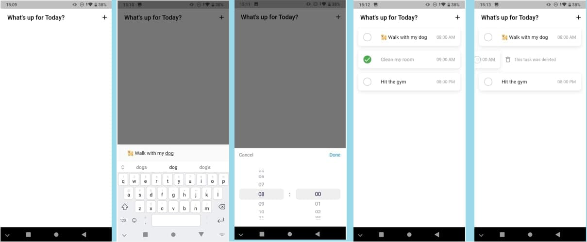

# task_manager_hive_getx

This is a daily task manager app made in flutter using hive to store and load daily tasks

## Key Points:

- Using Hive and extending HiveObject to use the functions save and delete
- Using a class HiveDataStore to control the functions of the box (add task, get task, update task, valuelistenable)
- Using InheritedWidget to generate an instance of HiveDataStore with will contain
- Using ValueListenableBuilder to load and listen to Hive.box modifications

## Source code:

The source code was provided by Santos Enoque [Build a minimalist Task Manager with Flutter and Hive](https://www.youtube.com/watch?v=Ys3vr3UdhUk)

**Check his [channel](https://www.youtube.com/channel/UCRl79zOEtiLCglAFZJJzEZQ) and support more flutter creators** :blue_heart: 

